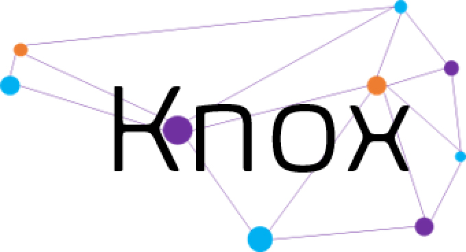

  

# KnoxApp - An AI-Powered tool for Genetic Circuit Generation and Prediction

## Quickstart

### Instructions
1) Install [Docker Desktop](https://www.docker.com/products/docker-desktop/)
2) Clone this repository
3) run `docker-compose up --build` in the root directory of this repo
4) Open Knox web interface at http://localhost:8080
5) Open Neo4j web interface at http://localhost:7474
6) Open MLflow web interface at http://localhost:5000
7) Open KnoxAI FASTAPI Docs at http://localhost:8000/docs
8) Open ctRSD-simulator-API FASTAPI Docs at http://localhost:8010/docs

## AI Chat / Agent Integration

### Setup
1) Get an API-key from [OPENAI](https://platform.openai.com/api-keys) or [CLAUDE](https://platform.claude.com/docs/en/get-api-key)
2) Set "OPENAI_API_KEY" or "CLAUDE_API_KEY" Environment Variable with API-key
4) You can then run the application and use the AI features via the AI Chat

## Manuscript

Nicholas Roehner, James Roberts, Andrei Lapets, Dany Gould, Vidya Akavoor, Lucy Qin, D. Benjamin Gordon, Christopher Voigt, and Douglas Densmore. GOLDBAR: A Framework for Combinatorial Biological Design. ACS Synthetic Biology Article ASAP (2024). 

DOI: https://pubs.acs.org/doi/full/10.1021/acssynbio.4c00296

## Webpage

https://www.cidarlab.org/knox
